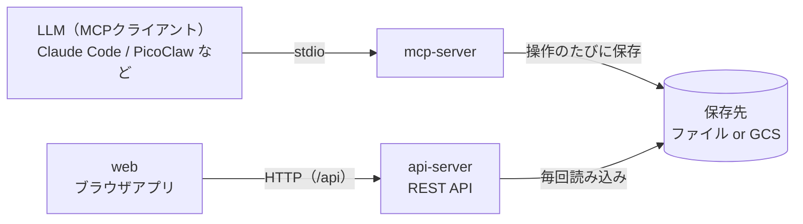
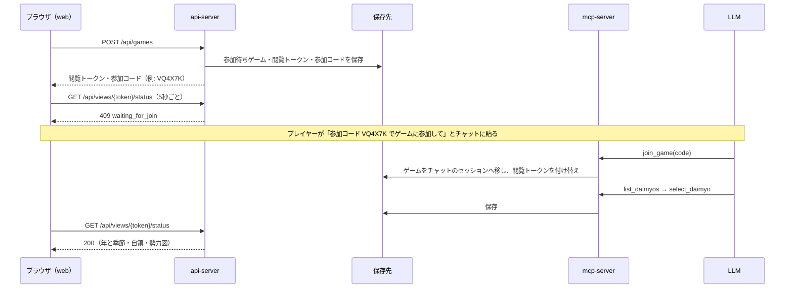

# mcp-server・api-server・web の連携マニュアル

LLM（MCP クライアント）で進めているゲームの状況を、ブラウザ（web）で表示するための構成・環境変数・手順をまとめます。

## 目次

1. [全体構成](#1-全体構成)
2. [環境変数一覧](#2-環境変数一覧)
3. [ローカルで動かす（ファイル保存）](#3-ローカルで動かすファイル保存)
4. [Google Cloud Storage で動かす](#4-google-cloud-storage-で動かす)
5. [Web アプリを本番向けに配信する](#5-web-アプリを本番向けに配信する)
6. [ゲーム開始の流れ（参加コード）](#6-ゲーム開始の流れ参加コード)
7. [動作確認](#7-動作確認)
8. [トラブルシューティング](#8-トラブルシューティング)
9. [保存先のデータ構成](#9-保存先のデータ構成)
10. [セキュリティ上の注意](#10-セキュリティ上の注意)

---

## 1. 全体構成



| コンポーネント | 役割 | 起動方法 |
| --- | --- | --- |
| `mcp-server` | LLM からのツール呼び出しでゲームを進め、操作のたびにセッションを保存先へ書き込む | MCP クライアントが stdio で起動 |
| `api-server` | 保存先からセッションを読み込み、REST API で状況を返す。Web からのゲーム作成も受け付ける | `cargo run -p api-server` |
| `web` | api-server を 5 秒ごとに呼び出し、年と季節・自領・勢力図を表示する | `pnpm dev`（開発）／静的ファイル（本番） |

**mcp-server と api-server は同じ保存先を参照する必要があります。** 両者は直接通信せず、保存先（ファイルまたは GCS）を介して状態を共有します。
保存先の設定（`SENGOKU_STORAGE` など）は **両方のプロセスに同じ値** を指定してください。

---

## 2. 環境変数一覧

### 2.1 保存先（mcp-server・api-server 共通。必ず両方に同じ値を指定）

| 変数 | 必須 | 既定値 | 説明 |
| --- | --- | --- | --- |
| `SENGOKU_STORAGE` | - | `file` | 保存先の種類。`file`（ローカルファイル）または `gcs`（Google Cloud Storage） |
| `SENGOKU_SESSIONS_DIR` | `file` 時は推奨 | `data/sessions` | `file` の保存先ディレクトリ。**既定値は起動ディレクトリからの相対パス** なので、絶対パスで指定すること（[8章](#8-トラブルシューティング)参照） |
| `SENGOKU_GCS_BUCKET` | `gcs` 時は必須 | なし | GCS のバケット名 |
| `SENGOKU_GCS_PREFIX` | - | `sessions` | GCS のオブジェクトキーの接頭辞（前後の `/` は無視） |

### 2.2 GCS の認証（`SENGOKU_STORAGE=gcs` の場合）

以下の順に認証情報を探します。いずれか 1 つを用意してください。

| 方法 | 指定方法 | 主な用途 |
| --- | --- | --- |
| サービスアカウントキー（ファイル） | `GOOGLE_SERVICE_ACCOUNT`（または `GOOGLE_SERVICE_ACCOUNT_PATH`）にキー JSON のパス | ローカル・CI |
| サービスアカウントキー（文字列） | `GOOGLE_SERVICE_ACCOUNT_KEY` にキー JSON の内容 | シークレットを環境変数で渡す環境 |
| Application Default Credentials | `GOOGLE_APPLICATION_CREDENTIALS` に認証ファイルのパス、または `gcloud auth application-default login` 済み（`~/.config/gcloud/application_default_credentials.json`） | ローカル開発 |
| メタデータサーバー | 設定不要（実行環境のサービスアカウントを使用） | Cloud Run・GCE・GKE |

使用するアカウントには、対象バケットのオブジェクトの読み書き権限（例: `roles/storage.objectUser`）が必要です。

### 2.3 mcp-server のみ

| 変数 | 必須 | 既定値 | 説明 |
| --- | --- | --- | --- |

### 2.4 api-server のみ

| 変数 | 必須 | 既定値 | 説明 |
| --- | --- | --- | --- |
| `SENGOKU_API_ADDR` | - | なし | 待ち受けアドレス（例: `127.0.0.1:8080`）。指定すると `PORT` より優先 |
| `PORT` | - | `8080` | 待ち受けポート（`0.0.0.0:<PORT>` で待ち受け）。Cloud Run が自動で設定する |
| `SENGOKU_CORS_ALLOW_ORIGINS` | 別オリジン配信時 | なし（CORS なし） | Web を api-server と別オリジンで配信する場合に許可するオリジン。カンマ区切り（例: `https://sengoku.example.com,http://localhost:5173`）。`*` で全許可 |

### 2.5 web のみ

| 変数 | タイミング | 既定値 | 説明 |
| --- | --- | --- | --- |
| `SENGOKU_API_URL` | `pnpm dev` 実行時 | `http://localhost:8080` | 開発サーバーが `/api` をプロキシする先（api-server の URL） |
| `VITE_API_BASE_URL` | `pnpm build` 実行時（ビルド時に埋め込み） | 空（同一オリジン） | 本番で api-server が別オリジンの場合の API のベース URL（例: `https://api.sengoku.example.com`） |

### 2.6 開発用

| 変数 | 説明 |
| --- | --- |
| `UPDATE_OPENAPI` | `UPDATE_OPENAPI=1 cargo test -p api-server --test openapi_test` で `api-server/openapi.json` を再生成する（テスト専用） |

---

## 3. ローカルで動かす（ファイル保存）

ここでは保存先を `/Users/you/sengoku-data` とします（任意の絶対パスに読み替えてください）。

### 3.1 ビルド

```bash
cargo build --release -p mcp-server -p api-server
cd web && pnpm install && cd ..
```

### 3.2 MCP クライアントの設定

MCP サーバーの設定（`.rulesync/mcp.json` から生成した `.mcp.json`、または各クライアントの設定）の `env` に保存先を指定します。

```jsonc
{
  "mcpServers": {
    "sengoku-mcp": {
      "type": "stdio",
      "command": "cargo",
      "args": ["run", "--release", "--manifest-path", "/path/to/sengoku-mcp/Cargo.toml", "-p", "mcp-server"],
      "env": {
        "SENGOKU_SESSIONS_DIR": "/Users/you/sengoku-data"
      }
    }
  }
}
```

設定を変更したら **MCP クライアントを再起動** してください（`join_game` などのツールが読み込み直されます）。

### 3.3 api-server と web の起動

```bash
# ターミナル1: api-server（mcp-server と同じ保存先を指定）
SENGOKU_SESSIONS_DIR=/Users/you/sengoku-data cargo run --release -p api-server

# ターミナル2: web（/api を http://localhost:8080 へプロキシ）
cd web && pnpm dev
```

ブラウザで http://localhost:5173 を開き、[6章](#6-ゲーム開始の流れ参加コード)の手順でゲームを始めます。

---

## 4. Google Cloud Storage で動かす

### 4.1 準備

```bash
# バケットを作成（名前・リージョンは任意）
gcloud storage buckets create gs://my-sengoku-bucket --location=asia-northeast1

# ローカルから使う場合は ADC を用意
gcloud auth application-default login
```

### 4.2 起動

mcp-server と api-server の **両方** に同じ設定を指定します。

```bash
export SENGOKU_STORAGE=gcs
export SENGOKU_GCS_BUCKET=my-sengoku-bucket
export SENGOKU_GCS_PREFIX=sessions   # 省略可

cargo run --release -p api-server
```

MCP クライアントの設定では `env` に同じ 3 つを記載します（`SENGOKU_SESSIONS_DIR` は不要）。

### 4.3 api-server を Cloud Run にデプロイする場合

- `PORT` は Cloud Run が設定するため指定不要です。
- 認証はサービスのサービスアカウント（メタデータサーバー）を使うため、キーは不要です。サービスアカウントにバケットの読み書き権限を付与してください。
- 環境変数として `SENGOKU_STORAGE=gcs`・`SENGOKU_GCS_BUCKET`・（必要なら）`SENGOKU_GCS_PREFIX`・`SENGOKU_CORS_ALLOW_ORIGINS` を設定します。
- mcp-server（各プレイヤーの手元で動く）も同じバケット・接頭辞を参照するようにしてください。

---

## 5. Web アプリを本番向けに配信する

```bash
cd web
# api-server が別オリジンの場合のみ VITE_API_BASE_URL を指定（ビルド時に埋め込まれる）
VITE_API_BASE_URL=https://api.sengoku.example.com pnpm build
# → web/dist/ を静的ホスティング（Cloud Storage・Firebase Hosting など）へ配置
```

| 配信方法 | 必要な設定 |
| --- | --- |
| api-server と同一オリジン（リバースプロキシで `/api` を api-server へ転送） | `VITE_API_BASE_URL` は不要 |
| api-server と別オリジン | web: `VITE_API_BASE_URL`、api-server: `SENGOKU_CORS_ALLOW_ORIGINS` に web のオリジン |

---

## 6. ゲーム開始の流れ（参加コード）

Web アプリは LLM 側のセッション ID を知らないため、**ブラウザでゲームを作成し、参加コードをチャットで伝える** ことで連携します。



- 参加コードは 6 文字、**30 分有効・1 回限り**。大文字小文字・ハイフン・空白は区別しません。
- 同じチャットで別のゲームに参加すると、進行中のゲームは置き換わり、古い閲覧 URL は 404 になります。

---

## 7. 動作確認

```bash
# api-server が起動しているか
curl http://localhost:8080/health          # → ok

# ゲーム作成（参加コードが返る）
curl -X POST http://localhost:8080/api/games

# API 仕様
open http://localhost:8080/docs            # ドキュメント画面（Scalar）
curl http://localhost:8080/openapi.json    # OpenAPI 3.1
```

保存先に次のようなファイル（GCS ならオブジェクト）が作られていれば、mcp-server と api-server が同じ保存先を見ています（[9章](#9-保存先のデータ構成)参照）。

---

## 8. トラブルシューティング

| 症状 | 原因 | 対処 |
| --- | --- | --- |
| チャットで参加コードを伝えても「参加コードが見つかりません」 | mcp-server と api-server の保存先が違う。`SENGOKU_SESSIONS_DIR` 未指定時は **起動ディレクトリからの相対パス** `data/sessions` になり、MCP クライアントが起動する mcp-server とずれやすい | 両方に同じ **絶対パス** の `SENGOKU_SESSIONS_DIR`（GCS なら同じバケット・接頭辞）を指定 |
| 「参加コードの有効期限が切れています」 | 作成から 30 分経過 | ブラウザで新しいゲームを作成 |
| LLM が `join_game` を使えない | mcp-server が古い、または MCP クライアントが再起動されていない | `cargo build --release -p mcp-server` 後に MCP クライアントを再起動 |
| ブラウザが参加コードの画面のまま | LLM がまだ `join_game` を呼んでいない、または保存先が違う | チャットに参加コードを伝え直す。保存先の設定を確認 |
| ブラウザが「大名を選んでください」のまま | 参加済みだが大名が未選択 | LLM に大名を選んでもらう（`select_daimyo`） |
| ブラウザが「このゲームは終了しています」 | 閲覧トークンが無効（別ゲームに置き換え・7 日以上放置で削除・URL の誤り） | 新しいゲームを作成 |
| ブラウザが「接続できません」（一時的なエラーは自動で2回まで再試行した後に表示） | api-server が起動していない、または `SENGOKU_API_URL`／`VITE_API_BASE_URL` の誤り | api-server の起動とURLを確認 |
| ブラウザのコンソールに CORS エラー | Web と api-server が別オリジンで、許可されていない | api-server に `SENGOKU_CORS_ALLOW_ORIGINS` を指定 |
| api-server が `SENGOKU_STORAGE=gcs の場合は SENGOKU_GCS_BUCKET を指定してください` で終了 | バケット名が未指定 | `SENGOKU_GCS_BUCKET` を指定 |
| GCS 使用時に 500（ログに `Error performing token request`） | 認証情報が見つからない、または権限不足 | [2.2](#22-gcs-の認証sengoku_storagegcs-の場合)の認証方法とバケット権限を確認 |

REST API のエラーコード（`code`）の一覧は `http://localhost:8080/docs` または [api-server/openapi.json](../api-server/openapi.json) を参照してください。

---

## 9. 保存先のデータ構成

`file` の場合は `SENGOKU_SESSIONS_DIR` 配下、`gcs` の場合は `gs://<SENGOKU_GCS_BUCKET>/<SENGOKU_GCS_PREFIX>/` 配下に保存されます。

```text
<保存先>/
├─ <セッションID>.json      … ゲームの状態（チャットのセッションごと。英数字・_・- 以外は _ に置換）
├─ web_<乱数>.json         … ブラウザで作成し、まだチャットが参加していないゲーム
├─ view_tokens/<トークン>.json … 閲覧トークン → セッションID の対応
└─ join_codes/<参加コード>.json … 参加コード → 参加待ちゲームの対応（30分で期限切れ）
```

- 最終アクセスから 7 日以上経過したセッションは、mcp-server の起動時と 1 時間ごとに削除されます（`view_tokens/`・`join_codes/` は対象外。期限切れの参加コードは別途削除）。
- mcp-server はセッションをメモリにもキャッシュするため、**同じ保存先に複数の mcp-server を同時に書き込ませる構成は想定していません**（api-server は読み取り中心なので複数台で問題ありません）。

---

## 10. セキュリティ上の注意

- api-server には認証機能がありません。インターネットに公開する場合は Cloud Run の IAM 認証やリバースプロキシで保護してください。
- `POST /api/games` は誰でもゲーム（保存先のファイル）を作成できるため、公開時はレート制限を検討してください。
- 閲覧 URL（トークン）は「知っている人なら誰でも見られる」共有リンクです。
- `GET /api/status`・`GET /api/sessions/{session_id}/status` はセッション ID だけで参照できるため、公開環境ではアクセスを制限してください。
